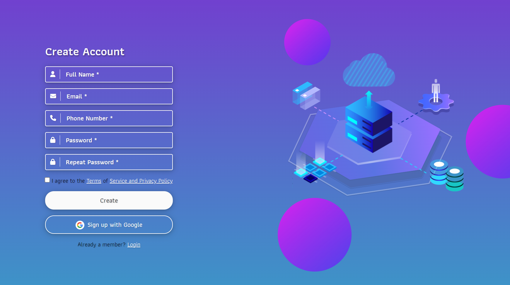

# Sign-Up Page 🔐

## Project Overview  
This is a frontend-only **Sign-Up Page** created as a **CSS exercise** for **The Odin Project**. The page is designed to be user-friendly and responsive, allowing users to enter information and interact with the sign-up form. It emphasizes CSS styling techniques to achieve a smooth UI/UX.

## Live Preview
Check out the deployed project here: Sign-Up Page Live Preview https://555viktor.github.io/odin-sign-up/

## Features  
The sign-up form includes the following fields and options:

- **Full Name**: Input for the user’s first and last name.
- **Email**: Input for email address with validation styling.
- **Phone**: Optional field for contact number.
- **Password & Repeat Password**: Fields to enter and confirm the user’s password.
- **Terms and Conditions Checkbox**: Ensures users agree to terms before account creation.
- **Create Account Button**: Submits the form.
- **Alternative Authentication with Google**: Mock button for Google sign-up.

> Note: Currently **frontend-only**, no backend or database integration.

## Technologies Used  
- **HTML** – Provides the form structure and layout.
- **CSS** – Used for styling the form and ensuring responsiveness across devices.
- **JavaScript** - Applied for basic form validation.

## Installation

To get started with this project locally:

1. Clone the repository:
   ```bash
   git clone https://github.com/555Viktor/odin-sign-up.git
   ```

2. Navigate into the project folder:
   ```bash
   cd odin-sign-up
   ```

3. Open `index.html` in your preferred browser to view the sign-up page.

## Usage  

1. **Fill Out the Form**:  
   - Enter user details  (full name, email, phone, and password).
   - Check the box to agree to the terms and conditions.
   - Click on "Create" to submit.
   - Alternatively sign up with Google

2. **Responsive Design**:  
   - The form layout adjusts for all screen sizes, ensuring quality UX for desktop and mobile.


> **Design Credit**: The visual design for this project was created by **[**Rozha Giya**](https://www.figma.com/@R_G)**, while all coding and implementation were done by **[me](https://github.com/555Viktor)**
